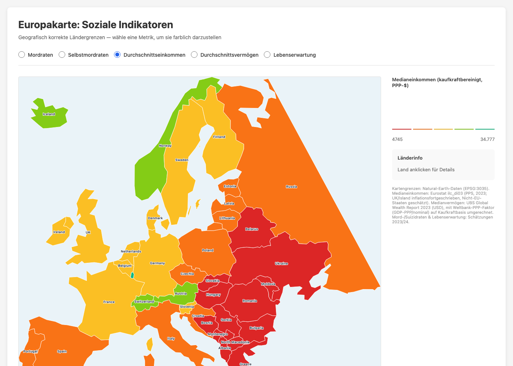

# Europakarte: Soziale Indikatoren

Interaktive, geografisch korrekte Europakarte zur Visualisierung sozialer und
wirtschaftlicher Indikatoren pro Land. Eine Metrik wird per Radiobutton ausgewählt und
als Choroplethenkarte eingefärbt; ein Klick auf ein Land zeigt alle Werte im Detail.



## Verwendung

Die Datei ist vollständig selbstständig (kein Server, kein Build) — einfach öffnen:

```bash
open europe_map.html
```

## Verfügbare Metriken

- **Mordraten** (pro 100.000 Einwohner)
- **Selbstmordraten** (pro 100.000 Einwohner)
- **Medianeinkommen** (kaufkraftbereinigt, PPP-$)
- **Medianvermögen** (kaufkraftbereinigt, PPP-$)
- **Lebenserwartung** (Jahre)

## Datenquellen

- **Kartengrenzen**: Natural-Earth-Geodaten, projiziert in EPSG:3035 (ETRS89-LAEA Europe).
- **Medianeinkommen**: Eurostat `ilc_di03` (Median-Äquivalenzeinkommen, PPS, 2023). Für
  UK/Island wurden veraltete Eurostat-Werte inflationsfortgeschrieben; für Nicht-EU-Staaten
  ohne Eurostat-Reihe (Russland, Ukraine, Belarus, Moldau, Bosnien, Kosovo) wurde der Wert
  über ein kalibriertes Verhältnis zum PPP-BIP/Kopf geschätzt.
- **Medianvermögen**: UBS Global Wealth Report 2023 (Median-Vermögen pro Erwachsenem, USD),
  mit einem Weltbank-PPP-Faktor (PPP-BIP ÷ nominales BIP je Land) auf Kaufkraftbasis
  umgerechnet.
- **Mord-/Suizidraten & Lebenserwartung**: Schätzungen 2023/24.

Details zur internen Struktur der Datei und zur Datenherkunft je Feld stehen in
[`CLAUDE.md`](CLAUDE.md).
